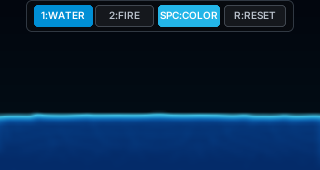
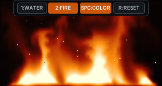

# Water & Fire





An IMU-controlled CardputerZero simulation app built with LVGL 9.5.

The water mode ports the FLIP particle-fluid algorithm from the reference
[esp32-led-matrix](https://github.com/ccbycc/esp32-led-matrix) firmware. Fire
mode uses a 96 x 52 Eulerian combustion field
with shared velocity, temperature, fuel, and emission layers. Buoyancy,
pressure projection, vorticity confinement, and semi-Lagrangian transport let
neighboring flames merge and pull on one another across a full-width fuel bed.
On CardputerZero, gravity comes from the BMI270 Linux IIO interface. The desktop
simulator uses the arrow keys as a virtual gravity vector.

## Simulation design

Water physics runs on a 48-cell vertical grid (about 97 x 48 cells for the 2:1
tank), with two solver substeps per displayed frame. The pressure projection is
the expensive part: its cost scales with grid cells, pressure iterations, and
substeps, while the particle separation pass also scales with particle count.
A native 320 x 170 FLIP grid would contain more than eleven times as many cells
and far more particles. The lower physics resolution is therefore intentional;
separable spatial filtering, temporal filtering, and bilinear sampling produce
the final 320 x 170 image.

The 96 x 52 fire field is bilinearly sampled at 320 x 170. Physical temperature
drives the flow while a separate, shorter-lived emission field controls visible
brightness, preventing hot exhaust from becoming a solid glowing wall. Cinders
are composited afterward so interpolation does not turn them into soft blobs.

Water uses full-width initial particle packing, wall-aware separation, and a
smoothed density constraint to preserve visible volume. It keeps simulating at
rest; speed-dependent viscosity removes constraint noise without a sleep timer.

## Controls

| Key | Action |
| --- | --- |
| `Tab` | Switch between water and fire |
| `1` / `2` | Select water / fire |
| Arrow keys | Simulate tilt on desktop |
| `Space` | Change the current mode palette |
| `Enter` or `R` | Reset both simulations |
| Hold `ESC` for 3 seconds | Exit |

A short `ESC` press displays the required exit hint without closing the app.

## Windows Simulator

```powershell
$env:VCPKG_ROOT="C:\vcpkg"
cmake --preset win32-mingw64
cmake --build --preset win32-mingw64-dbg
.\build\mingw64\Debug\water_fire_simulator.exe
```

Optional standalone physics regression test:

```powershell
cmake --preset win32-mingw64 -DWATER_FIRE_BUILD_TESTS=ON
cmake --build --preset win32-mingw64-dbg
ctest --test-dir build\mingw64 -C Debug --output-on-failure
```

## CardputerZero Package

On a Debian-based host with the AArch64 cross compiler installed:

```shell
cmake --workflow --preset cp0-cross-package
```

The package is written to `dist/` with a filename derived from the current
project version, for example:

```text
dist/WaterFireSimulator_1.0.9_m5stack1_arm64.deb
```

Runtime requirements are declared in `app-builder.json`. The app requires the
IMU, does not use the network, and does not run as a background service.

## Attribution

The FLIP implementation is adapted from Matthias Mueller's Ten Minute Physics
work and the [esp32-led-matrix](https://github.com/ccbycc/esp32-led-matrix)
firmware port. The DOOM fire implementation is
adapted from the same reference firmware. See source headers and `LICENSE` for
the MIT license notices.
